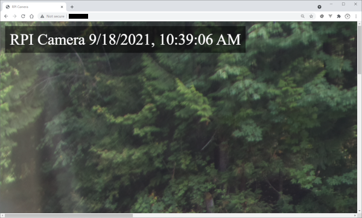

# Rpi_NodeCamera
A NodeJS application for capturing and rendering camera images without saving to disk

```
user@raspberrypi:~/Public/Rpi_NodeCamera $ sudo nodemon app.js 
[nodemon] 2.0.12
[nodemon] to restart at any time, enter `rs`
[nodemon] watching path(s): *.*
[nodemon] watching extensions: js,mjs,json
[nodemon] starting `node app.js`
9/18/2021, 10:49:40 AM RPI Camera listening at http://localhost:80
9/18/2021, 10:49:41 AM Taking a picture!
9/18/2021, 10:49:43 AM Sent picture
```



## Running

* Start with NodeJS

```
sudo node app.js
```

* Launch and reload if any files change during development

```
sudo nodemon app.js
```

* Open the server in the browser at `http://IP_ADDRESS`.

* You can find the `IP_ADDRESS` by running a command in the terminal.

```
ifconfig
```

## Running at boot

* Open up the crontab:

```
sudo crontab -e
```

* Add this to your crontab:

```
@reboot nodemon /home/pi/Public/Rpi_NodeCamera/app.js
```

* Reboot

```
sudo shutdown -r now
```

## Required Hardware

* [Raspberry Pi High Quality Camera](https://www.raspberrypi.org/products/raspberry-pi-high-quality-camera/) - Max Resolution (4056x3040)

* [HQ Setup Video](https://www.youtube.com/watch?v=3S1MQM8B-DU)

* [Raspberry PI 4](https://www.raspberrypi.org/products/raspberry-pi-4-model-b/) - More power to handle all the pixels

## Required Software

* [NodeJS and NPM](https://linuxize.com/post/how-to-install-node-js-on-raspberry-pi/)

```
curl -sL https://deb.nodesource.com/setup_12.x | sudo bash -
sudo apt install nodejs
```

* [Turn off the camera LED for Raspberry Pi](https://howtoraspberrypi.com/disable-led-camera-pi/)

```
sudo vi /boot/config.txt
```

* Disable the LED light on the RPI camera. Add to the end of the file.

```
disable_camera_led=1
```

## Useful Tools

* [Visual Studio Code on Raspberry Pi](https://code.visualstudio.com/docs/setup/raspberry-pi)

```
sudo apt update
sudo apt install code
```

* [Nodemon](https://www.npmjs.com/package/nodemon)

```
sudo npm install -g nodemon
```

## Dependencies

* Run these commands within the cloned repository.

* [ExpressJS](https://expressjs.com/en/starter/installing.html)

```
npm install express
```

* [pi-camera](https://www.npmjs.com/package/pi-camera) - [Source](https://github.com/stetsmando/pi-camera)
```
npm install pi-camera
```

* [PI camera usage](https://www.raspberrypi.org/documentation/accessories/camera.html)

* To add time support for the pi-camera module, clone within node_modules.

```
cd node_modules
rm -r -f pi-camera
git clone https://github.com/tgraupmann/pi-camera/
```
